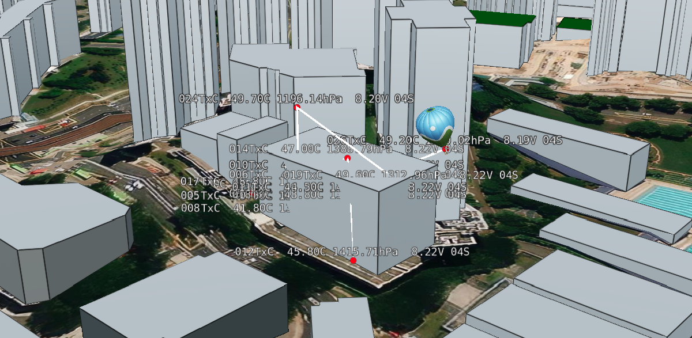
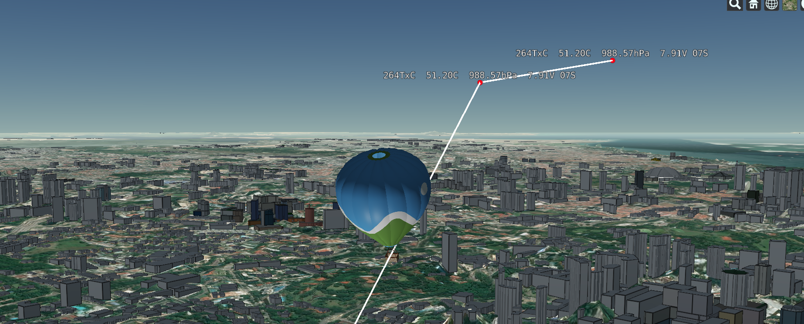

# cesium-aprs-flight-tracker

## Project setup

In order to run the server, you need `.env` (see `.env.example`) and `flight_data.json` (which is your JSON database for APRS flight data). The server should start running with `yarn serve`. Go to `localhost.com:8000` to see the 3D tracker, and start sending APRS packets via TCP to `localhost.com:3000` in the same format used to upload to APRS-IS.
```
touch flight_data.json
cp .env.example .env
yarn serve
```

This server is designed to make use of GNU Radio's [gr-ax25 OOT module by dl1ksv](https://github.com/dl1ksv/gr-ax25) to demodulate the APRS packets. Since a custom flowgraph is needed, use our forked version instead. We have created [a flowgraph](https://github.com/t0x1c-v4p0r/gr-ax25/blob/main-flight-tracker/apps/aprs_for_cesium_flight_tracker.grc) for you to use if you connect your HT to your computer via an audio cable.

## Sample images

You may expect your 3D flight tracker to look something like the images shown below.





## Issues and suggestions

Please feel free to open an issue or a pull-request!
